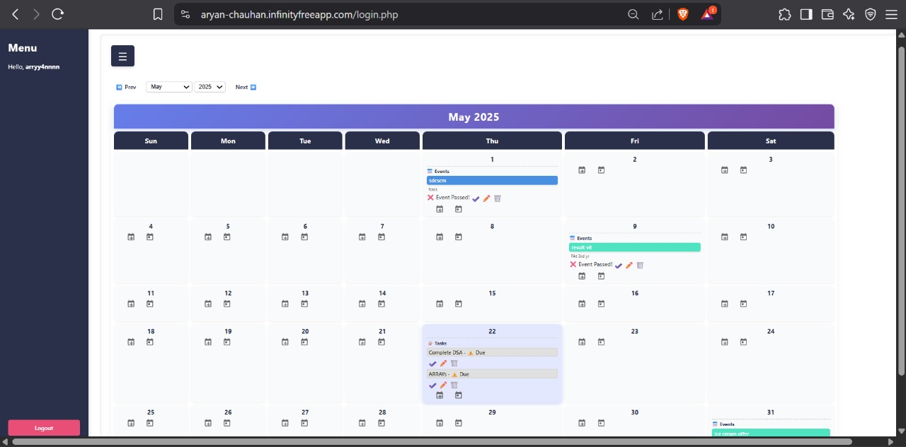
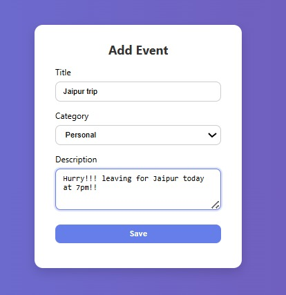
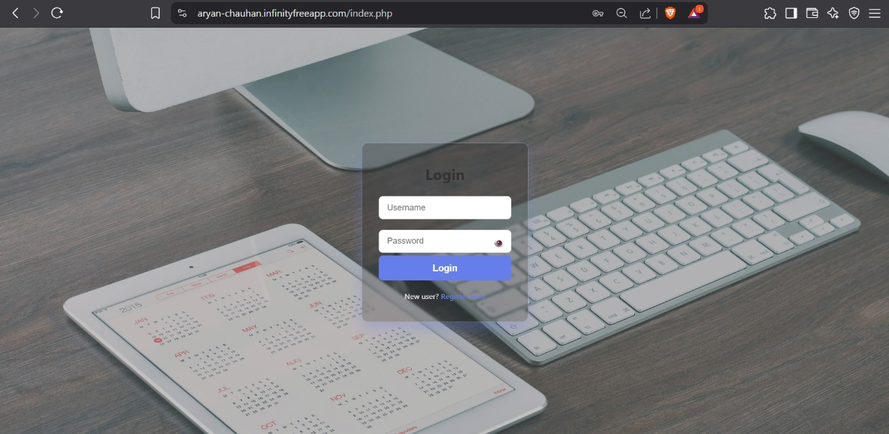

# 📅 PHP Calendar & Event Planner

A complete calendar and event planner built with PHP + MySQL. Features user authentication, color-coded events, categories, and daily email reminders.

## 🌐 Live Demo

The website is hosted on **InfinityFree** and accessible at:  
[Aryan-Chauhan.infinityfreeapp.com](https://Aryan-Chauhan.infinityfreeapp.com)

Feel free to explore the live demo!

## ✨ Features
- User authentication (login/register/logout)
- Monthly calendar view
- Add, edit, delete events
- Color-coded event categories
- Email reminders via scheduled cron job

## 🖼️ Screenshots

### Monthly Calendar View  

### Event Creation Form  

### Email Reminder Example  

## 🔧 Setup Instructions

1. Import the `sql/init.sql` file into your MySQL database.
2. Update your database credentials in `db.php`.
3. Serve the project via Apache or your local server (e.g., XAMPP).
4. Set up a cron job to send email reminders daily (example for 7 AM):

## 📁 Project Structure
- `index.php`: Main calendar view.
- `event_form.php`: Add or edit events.
- `send_reminders.php`: Script to send daily email reminders.

## 📜 License

This project is licensed under the **MIT License** — a permissive open-source license.  
You are free to use, modify, and distribute this software, even commercially, as long as you include the original license and copyright notice.

**No warranty is provided.** Use at your own risk.

---

